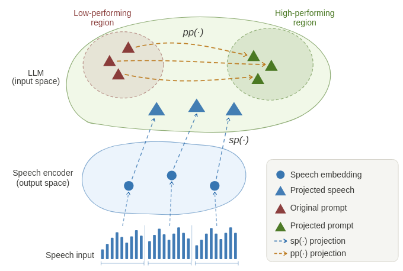

# Reducing Prompt Sensitivity in LLM-based Speech Recognition Through Learnable Projection

<div align="center">
  
  <p><em>In a typical LLM-based ASR system, speech is passed through a speech encoder and converted into a sequence of embeddings (<span style="color: #2E68DB;">●</span>), which are then projected, via a speech projector <span style="color: #2E68DB;">$sp(\cdot)$</span>, onto the LLM input embedding space (<span style="color: #2E68DB;">▲</span>).
    Similarly, we propose learning a new projection, <span style="color: #F99126;">$pp(\cdot)$</span>, able to project the original prompt embeddings (<span style="color: #881907;">▲</span>) onto higher-performing regions of the LLM input embedding space (<span style="color: #679B4E;">▲</span>).</em></p>
</div>


## 📘 More About This Work

> [!IMPORTANT]
> This repository contains the code for our paper on **Prompt Projector for LLM-based ASR** accepted to ICASSP 2026. Our work builds upon the [SLAM-LLM](https://github.com/X-LANCE/SLAM-LLM) framework, specifically extending the [ASR example](https://github.com/X-LANCE/SLAM-LLM/tree/main/examples/asr_librispeech) and is **based on a cloned version of the original repo**.
>
> **Quick Links:** [Extended Results](appendix.pdf) · [Scripts](scripts/README.md) · [Installation](#-installation) · [License](#-license)

### 🧪 Abstract

> LLM-based automatic speech recognition (ASR), a well-established approach, connects speech foundation models to large language models (LLMs) through a speech-to-LLM projector, yielding promising results. A common design choice in these architectures is the use of a fixed, manually defined prompt during both training and inference. This setup not only enables applicability across a range of practical scenarios, but also helps maximize model performance.
> However, the impact of prompt design remains underexplored.
> This paper presents a comprehensive analysis of commonly used prompts across diverse datasets, showing that prompt choice significantly affects ASR performance and introduces instability, with no single prompt performing best across all cases. Inspired by the speech-to-LLM projector, we propose a **prompt projector module**, a simple, model-agnostic extension that learns to project prompt embeddings to more effective regions of the LLM input space, without modifying the underlying LLM-based ASR model.
> Experiments on four datasets show that the addition of a prompt projector consistently improves performance, reduces variability, and outperforms the best manually selected prompts.

### 📊 Extended Results & Appendix

> [!IMPORTANT]
> Complementary experimental results referenced in the paper are consolidated in [`appendix.pdf`](appendix.pdf).
> The appendix includes: a comparison of Vicuna-7B vs. LLaMA3-8B performance in the LLM-based ASR setup, an analysis of the impact of k (the number of learnable embeddings) in prompt tuning experiments, and a series of experiments supporting the importance of freezing or not freezing the underlying model while training the Prompt Projector module.

## 🛠️ Implementation

Our **prompt projector** is implemented as a PEFT (Parameter-Efficient Fine-Tuning) mechanism by modifying the original HuggingFace PEFT library. We cloned and extended the [PEFT repository](https://github.com/huggingface/peft) to support the prompt projector as a new PEFT method. The `peft/` directory in this repository contains our modified version with the prompt projector implementation.

## 🔧 Modifications to Original Code


### 🌀 Changes to SLAM-LLM

We extended the original SLAM-LLM codebase with the following enhancements:

#### 🧩 Enhanced Prompt Configuration (YAML files in `conf/`)

- **Flexible `<speech>` token placement**: Unlike the original implementation where speech was always prepended to the prompt, our version allows the `<speech>` token to be placed anywhere in the prompt template.
- **Learnable token insertion with `<p:N>`**: Insert N learnable tokens at any position in the prompt using the `<p:N>` syntax (e.g., `<p:5>` inserts 5 learnable tokens).
- **Text-initialized learnable tokens with `<p:TEXT>`**: Initialize learnable tokens with user-provided text using the `<p:TEXT>` syntax (e.g., `<p:Transcribe the following audio>`).

#### ⚙️ New Training Configuration Options

Added the following settings to `train_config`:

- `save_checkpoint_only_at_epoch_end` (bool): Save checkpoints only at the end of each epoch instead of at every checkpoint interval.
- `freeze_projector` (bool): Freeze the projector module during training.
- `use_bf16` (bool): Enable bfloat16 training format.
- `peft_config.peft_method`: Added support for `"p-projector"` as valid PEFT method.
- `prompt_token` (str): Token used to mark learnable positions in prompts (default: `"<p>"`).
- `prompt_num_virtual_tokens` (int): Number of virtual tokens for "prefix" method.


### 📦 Changes to PEFT Library

We modified the original HuggingFace PEFT library to add:

- **P_PROJECTOR**: A new PEFT type that implements our prompt projector mechanism.
- **User-provided embedding initialization**: Support for initializing prompt embeddings with custom embeddings via the `virtual_token_embs` parameter in `PromptEncoder`.


## 🚀 Installation

### 🧱 Environment Setup

We provide a conda environment file for easy setup. To create and activate the environment:

```bash
conda env create -f environment.yml
conda activate slam_llm
```

> [!TIP]
> For additional installation details, troubleshooting, or alternative setup methods, please refer to the [original SLAM-LLM repository](https://github.com/X-LANCE/SLAM-LLM/).


## ▶️ Running Experiments

To reproduce the experiments from our paper:

1. First, read the two subsections below to understand the input data format and where to download the required model binaries.
2. Then, refer to the **[`scripts/`](scripts/) folder**, which contains all necessary training and evaluation scripts along with a detailed README explaining the complete workflow.

### 📁 Data preparation
You need to prepare the data jsonl in this format.
```
{"key": "1001-134707-0000_ASR", "source": "/data/open_data/librispeech_audio/audio/librispeech_1001-134707-0000.wav", "target": "1 little recks the laborer. How near his work is holding him to God, The loving laborer through space and time, after all, not to create, only or found only."}
...
{"key": "1001-134707-0000_ASR", "source": "/data/open_data/librispeech_audio/audio/librispeech_1001-134707-0000.wav", "target": "1 little recks the laborer. How near his work is holding him to God, The loving laborer through space and time, after all, not to create, only or found only."}
```

### Speech encoder and LLM model binaries

- Speech encoder: [WavLM-large](https://drive.google.com/file/d/12-cB34qCTvByWT-QtOcZaqwwO21FLSqU/view)
- LLM: [vicuna-7b-v1.5](https://huggingface.co/lmsys/vicuna-7b-v1.5)

For more details on the base SLAM-LLM framework, please refer to the [README.md of the original repo](https://github.com/X-LANCE/SLAM-LLM/tree/main/examples/asr_librispeech).

## 📄 License

Our original code additions and modifications (including the prompt projector mechanism, enhanced prompt handling, new training configuration options, and PEFT extensions) are licensed under the MIT License. Portions of this repository remain under their original upstream licenses:

- SLAM-LLM original code: MIT License
- HuggingFace components and PEFT upstream code: Apache License 2.0
- Certain integrated logic referencing Llama materials (e.g., adaptation utilities) is subject to the Llama 2 Community License

Please consult individual file headers and the `LICENSES/` directory for the full text of each applicable license:

- `LICENSES/MIT.txt`
- `LICENSES/APACHE-2.0.txt`
- `LICENSES/LLAMA2.txt`

Files we modified have a header block that explicitly lists the changes; only those listed modifications are under our MIT license. Everything else in those files keeps its original upstream license. Check each file header and the `LICENSES/` directory for exact licensing.
